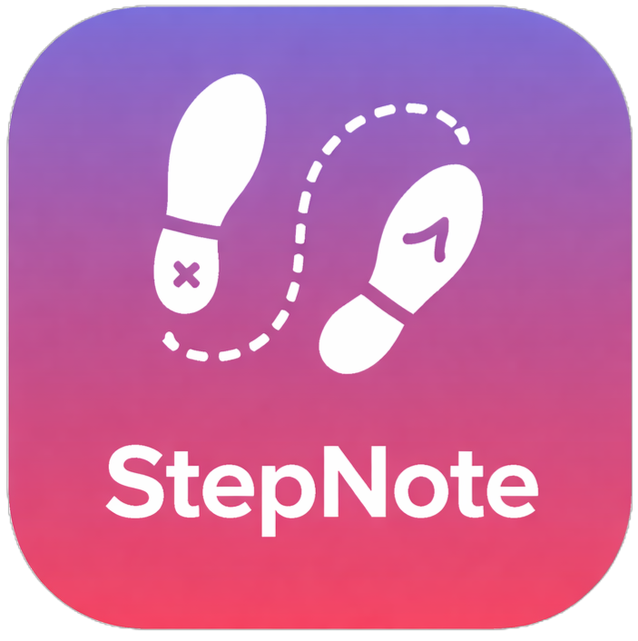

# StepNote - Flashcard Trainer

A modern, dynamic, and collaborative vocabulary training application built with Flutter. StepNote allows users to create personalized flashcard sets with rich media (videos/images), organize them into sets, and share them with friends or students via secure cloud links.



## Key Features

- **Media-Rich Flashcards:** Create cards with titles, descriptions, and attach videos or images directly from your gallery or camera.
- **Collaborative Sharing:** Share your sets via a unique link.
    - **View-Only:** Share sets for others to study.
    - **Collaborative:** Invite others to edit and add cards to your set.
- **Progression Mode:** Toggle between a standard Grid View and a **Progression Timeline** to visualize your learning journey chronologically.
- **Cloud Sync:** 
    - Automatically backs up your sets to the cloud.
    - Restores your sets when you log in on a new device.
    - Syncs changes between devices and collaborators.
- **Local-First Architecture:** Works offline! All data is stored locally in SQLite and syncs when online.
- **Dynamic Labeling & Filtering:** Organize with custom labels and filter by rating or label.
- **Modern UI:** Features a sleek, "glassy" design with smooth animations and gradients.

## How to Use

1.  **Create a Set:** Tap the '+' button on the main screen. Choose visibility (Private, Public View, Public Edit).
2.  **Add Cards:** Inside a set, tap the '+' FAB. Add text and video.
3.  **Share:** Tap the Share icon on a public set to generate a link. Send this link to a friend.
4.  **Join:** Tapping a shared link automatically opens StepNote, joins the set, and downloads it.
5.  **Sync:** 
    - Tap the **Upload** icon to push local changes to the cloud.
    - Tap the **Download** icon to pull the latest changes from collaborators.
6.  **Progression:** Inside a set, toggle the view icon in the top bar to switch between Grid and Timeline views.

## Architecture

StepNote follows a clean architecture using **Dependency Injection** (GetIt) and the **Repository Pattern**.

-   **Services:** Handle low-level APIs (`DatabaseService` for SQLite, `CloudService` for Firebase, `AuthService`).
-   **Repositories:** Abstract data sources. The UI interacts with `ISetRepository` and `ICardRepository`, which manage data flow between local storage and the cloud.
-   **UI:** Built with Flutter widgets, using `FutureBuilder` and `StreamBuilder` for reactive data display.

See [docs/Architecture.md](docs/Architecture.md) for a detailed diagram.

## Technology Stack

-   **Framework:** Flutter
-   **Local Database:** SQLite (`sqflite`)
-   **Cloud Backend:** Firebase (Auth, Firestore, Storage)
-   **Deep Linking:** `app_links`
-   **Video:** `video_player`, `easy_video_editor`
-   **State Management:** `setState` + Repository Pattern

## Getting Started

1.  **Install Dependencies:**
    ```bash
    flutter pub get
    ```
2.  **Generate Launcher Icons:**
    ```bash
    dart run flutter_launcher_icons
    ```
3.  **Run the App:**
    ```bash
    flutter run
    ```
