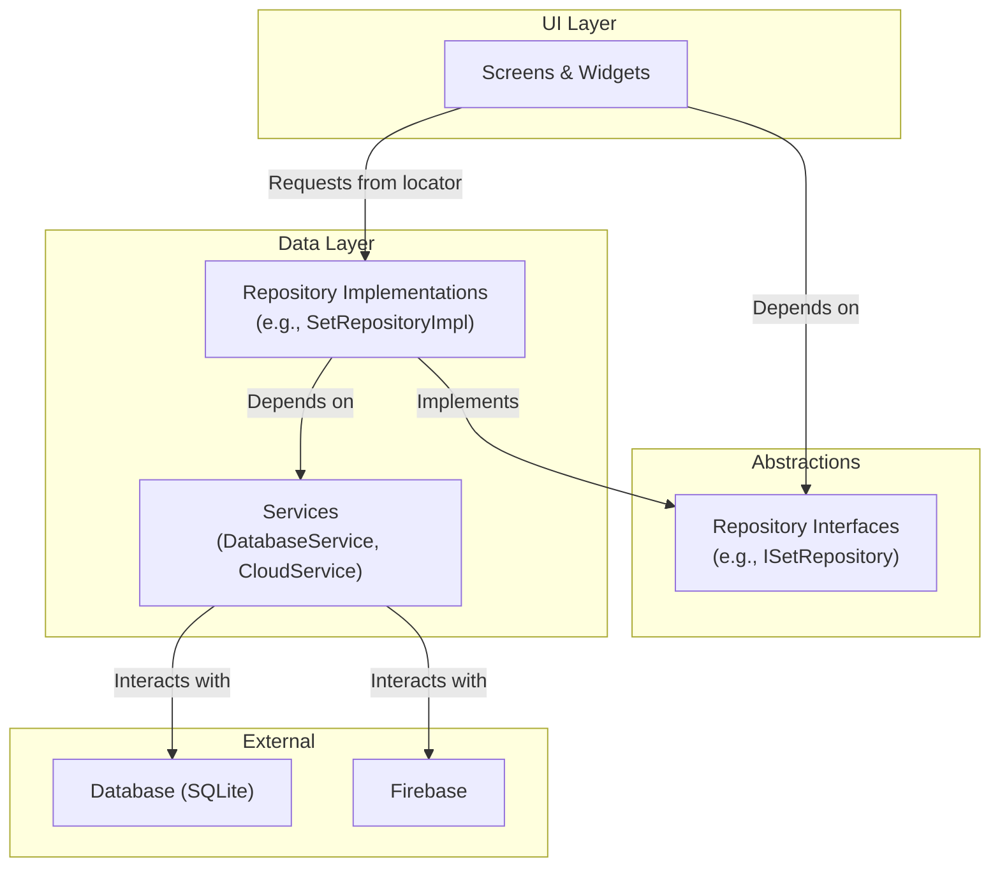
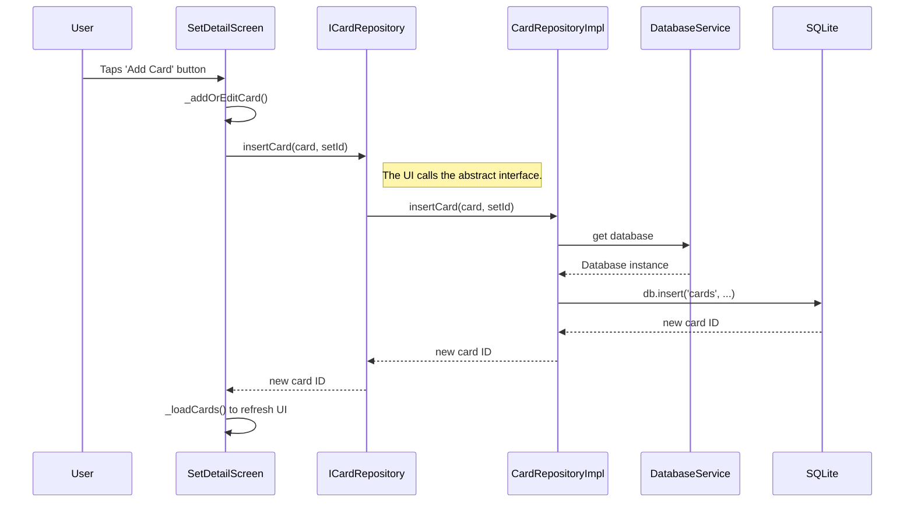

# Application Architecture & Data Flow

This document outlines the refactored architecture of the Flashcard Trainer application, focusing on SOLID principles, dependency injection, and clear data flow.

## 1. Core Principles

The new architecture is built upon two core principles:

- **Dependency Inversion Principle (DIP):** High-level modules (UI) do not depend on low-level modules (database). Both depend on abstractions (repository interfaces).
- **Single Responsibility Principle (SRP):** Classes are broken down into smaller, more focused units. For example, the old `DatabaseHelper` has been split into a `DatabaseService` and multiple repositories.

## 2. Dependency Injection with `get_it`

To manage dependencies and decouple our classes, we use the `get_it` package.

- **Configuration:** All services and repositories are registered in a central service locator.
  - See: `lib/app/locator.dart`
- **Usage:** When a class needs a dependency (like a repository), it requests it from the locator instead of creating it directly.

```dart
// Example from a widget
final ICardRepository _cardRepository = locator<ICardRepository>();
```

## 3. Architecture Overview

The application is now structured into distinct layers. The dependencies flow in one direction: UI -> Repositories -> Services.



### Key Components:

-   **Services (`lib/services/`):** Handle low-level tasks like initializing the database (`DatabaseService`) or interacting with cloud providers.
-   **Repository Interfaces (`lib/repositories/`):** Define the "contract" for what data operations are possible (e.g., `getAllSets()`, `insertCard()`). These are abstract classes.
-   **Repository Implementations (`lib/repositories/`):** The concrete classes that fulfill the repository contract. They contain the actual logic for fetching data from a source (like the `DatabaseService`).
-   **UI Layer (`lib/screens/`, `lib/widgets/`):** The Flutter widgets that display data and handle user input. They depend only on the repository *interfaces*, not the implementations.

## 4. Example Data Flow: Adding a New Card

Here is the sequence of events when a user adds a new card from the `SetDetailScreen`.



### File Links

-   **Service Locator:** `lib/app/locator.dart`
-   **Database Service:** `lib/services/database_service.dart`
-   **Repository Interfaces:**
    -   `lib/repositories/set_repository.dart`
    -   `lib/repositories/card_repository.dart`
    -   `lib/repositories/label_repository.dart`
-   **Repository Implementations:**
    -   `lib/repositories/set_repository_impl.dart`
    -   `lib/repositories/card_repository_impl.dart`
    -   `lib/repositories/label_repository_impl.dart`
